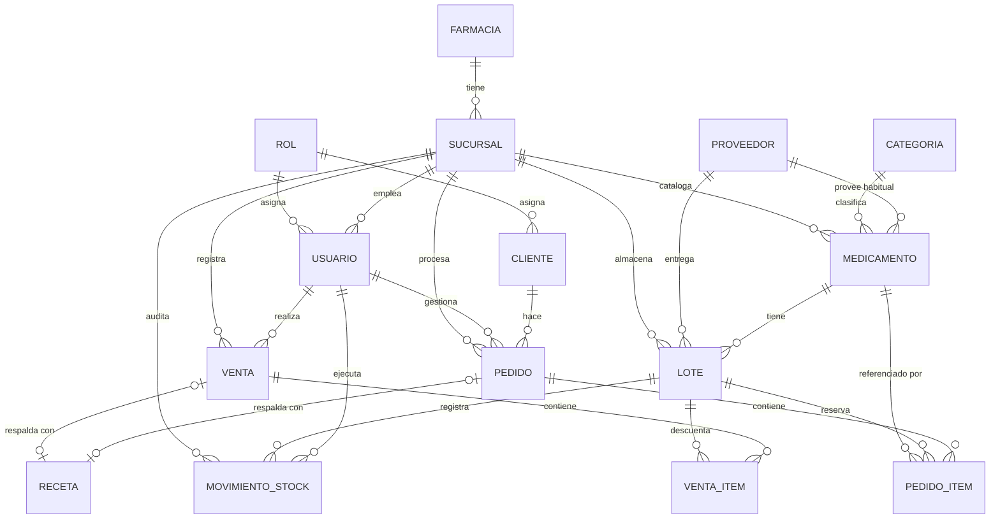

# Modelo de Datos — FarMedic

**Qué**: Diagrama entidad-relación completo del sistema. Fuente teórica para las migraciones Laravel → PostgreSQL.
**Por qué**: Define la base coherente sobre la que se construye el backend. Toda decisión de schema parte de aquí.

## Diagrama ER (Mermaid)

## Entidades

### Tenencia y catálogo
- [[farmacia]] — entidad raíz (cadena/negocio)
- [[sucursal]] — local físico, ancla del multi-tenancy
- [[categoria]] — clasificación de medicamentos
- [[proveedor]] — fuente de medicamentos y lotes
- [[medicamento]] — producto del catálogo
- [[lote]] — partida con vencimiento

### Usuarios y acceso
- [[rol]] — Administrador / Empleado / Cliente
- [[usuario]] — actor interno (admin, empleado)
- [[cliente]] — actor externo (canal online)

### Operaciones
- [[venta]] — transacción POS
- [[venta-item]] — línea de venta
- [[pedido]] — orden online
- [[pedido-item]] — línea de pedido
- [[movimiento-stock]] — Kardex auditable
- [[receta]] — respaldo de transacciones con medicamentos restringidos

## Decisión clave: tabla física `usuarios` compartida

Conceptualmente [[usuario]] (interno) y [[cliente]] (externo) son entidades distintas. **Físicamente viven en una sola tabla `usuarios`** con FK a [[rol]]:
- Auth única (Sanctum + Socialite)
- Email único cross-tipo (impide colisión cliente/empleado)
- Campos específicos como nullable (`sucursal_id` solo empleados; `direccion/telefono` solo clientes)

## Multi-tenancy

Todo dato operativo lleva `sucursal_id NOT NULL`:
- `usuarios.sucursal_id` (empleados; NULL para clientes)
- `medicamentos.sucursal_id`
- `lotes.sucursal_id`
- `ventas.sucursal_id`
- `pedidos.sucursal_id`
- `movimientos_stock.sucursal_id`

Las queries se filtran por sucursal según el rol. Admin puede consultar cross-sucursal vía policy; Empleado restringido a la suya.

## Enums

| Enum | Valores |
|------|---------|
| `Rol.nombre` | administrador, empleado, cliente |
| `MovimientoStock.tipo` | ingreso, venta, devolucion_cliente, devolucion_proveedor, ajuste, vencimiento, perdida |
| `Venta.estado` | completada, anulada |
| `Venta.metodo_pago` | efectivo, tarjeta, transferencia |
| `Pedido.tipo_entrega` | retiro_local, domicilio |
| `Pedido.estado` | pendiente, en_camino, entregado, cancelado |

## Fuera de alcance MVP (documentado para futuro)

| Entidad | Por qué no se modela ahora | Alternativa actual |
|---------|---------------------------|---------------------|
| `Permiso` | granularidad alta sobre rol | Laravel Policies hardcoded |
| `Direccion` | múltiples direcciones por cliente | snapshot en `pedido.direccion_envio` |
| `EstadoPedidoHistorial` | trazabilidad temporal | `pedido.fecha_envio` + `pedido.fecha_entrega` |
| `Notificacion` | alertas persistidas | derivadas de queries de stock/lote |
| `Devolucion` | proceso explícito de refund | cubierto por [[movimiento-stock]] con tipo `devolucion_*` |

## Convenciones

- Nombres de tabla en **plural español**: `farmacias`, `sucursales`, `medicamentos`, `lotes`, `ventas`, `venta_items`, `pedidos`, `pedido_items`, `recetas`, `usuarios`, `roles`, `categorias`, `proveedores`, `movimientos_stock`
- PKs `id` autoincremental
- FKs `<entidad>_id`
- Timestamps `created_at`, `updated_at` (Laravel default)
- Soft deletes solo en `medicamentos` y `proveedores` (no en transaccionales)

## Estado de implementación

| Capa                                         | Estado                                                                        |          |                |
| -------------------------------------------- | ----------------------------------------------------------------------------- | -------- | -------------- |
| Migraciones (14 + Sanctum)                   | ✅ Aplicadas a PostgreSQL                                                      |          |                |
| Modelos Eloquent (14)                        | ✅ En `Backend/app/Models/` con relaciones, casts y scopes                     |          |                |
| Controllers API (12)                         | ✅ En `Backend/app/Http/Controllers/Api/`                                      |          |                |
| Rutas API                                    | ✅ 49 endpoints en `Backend/routes/api.php` (prefix `/api`)                    |          |                |
| Seeder de [[rol]] (3 filas)                  | ✅ administrador, empleado, cliente                                            |          |                |
| Soft deletes                                 | `Proveedor`, `Medicamento` (destroy() = soft; `/restore` endpoint disponible) |          |                |
| Soft-deactivation via flag `activo`/`activa` | `Sucursal`, `Usuario` (destroy() = `activo=false`)                            |          |                |
| Append-only (`$timestamps=false`)            | `MovimientoStock`, `VentaItem`, `PedidoItem` (sin DELETE/UPDATE expuesto)     |          |                |
| `cantidad_actual` fuera de fillable          | `Lote` — controlado solo vía `MovimientoStock`                                |          |                |
| Polimorfismo                                 | `MovimientoStock.referencia_tipo`/`referencia_id` → `Venta` o `Pedido`        |          |                |
| Tabla `usuarios` compartida                  | Un solo controller; filtros por `?rol=cliente                                 | empleado | administrador` |
| `Lote` immutable                             | No DELETE (405); store() crea ingreso Kardex atómico                          |          |                |
| FEFO + Kardex en `Venta`/`Pedido`            | Descuento automático del lote con vencimiento más próximo                     |          |                |
| Estado machine `Pedido`                      | Transiciones validadas: pendiente→en_camino→entregado, * →cancelado           |          |                |
| `Venta` anular                               | Endpoint `/ventas/{id}/anular` genera movimientos `devolucion_cliente`        |          |                |
| Sanctum instalado                            | `personal_access_tokens` migrada; `HasApiTokens` en `Usuario`                 |          |                |

### Operaciones API por entidad

| Entidad               | Endpoints                                                   | Notas                                        |     |
| --------------------- | ----------------------------------------------------------- | -------------------------------------------- | --- |
| `Rol`                 | GET /roles                                                  | readonly                                     |     |
| `Farmacia`            | GET, PUT /farmacia                                          | singleton                                    |     |
| `Sucursal`            | apiResource + activa toggle en destroy                      | sin hard delete                              |     |
| `Usuario` (+ Cliente) | apiResource                                                 | password hash, activo toggle, filtro por rol |     |
| `Categoria`           | apiResource                                                 | FK restrict si hay medicamentos              |     |
| `Proveedor`           | apiResource + POST /restore                                 | soft delete                                  |     |
| `Medicamento`         | apiResource + POST /restore + search + filtro stock_critico | soft delete, búsqueda multi-canal RF-05      |     |
| `Lote`                | apiResource (sin destroy)                                   | store crea Kardex ingreso                    |     |
| `MovimientoStock`     | GET (index, show), POST                                     | append-only, sin update/destroy              |     |
| `Receta`              | POST, GET show                                              | inmutable                                    |     |
| `Venta`               | GET, POST + POST /anular                                    | sin update/destroy                           |     |
| `Pedido`              | GET, POST + PATCH /estado                                   | state machine                                |     |

## Relacionado

[[farmacia]] [[sucursal]] [[rol]] [[usuario]] [[cliente]] [[categoria]] [[proveedor]] [[medicamento]] [[lote]] [[movimiento-stock]] [[venta]] [[venta-item]] [[pedido]] [[pedido-item]] [[receta]]
